# OpenClaw 配置 GPUNexus API 完整手册

## 目录

1. [概述](#1-概述)
2. [环境准备](#2-环境准备)
   - 2.1 安装 Node.js
   - 2.2 安装 OpenClaw
3. [GPUNexus 平台配置](#3-gpunexus-平台配置)
   - 3.1 GPUNexus 简介
   - 3.2 获取 API Key
   - 3.3 理解两种 API 模式
   - 3.4 获取 API Key 详细流程
4. [配置文件详解](#4-配置文件详解)
   - 4.1 生成默认配置
   - 4.2 配置模型提供方
   - 4.3 完整配置字段说明
5. [启动服务](#5-启动服务)
   - 5.1 运行 onboard 命令
   - 5.2 向导配置步骤
   - 5.3 验证服务启动
6. [访问 WebUI](#6-访问-webui)
   - 6.1 本地访问
   - 6.2 远程访问（SSH 隧道）
7. [高级配置](#7-高级配置)
   - 7.1 多模型配置
   - 7.2 Gateway 配置说明
8. [常见问题](#8-常见问题)

---

## 1. 概述

本手册介绍如何在 OpenClaw 中配置 GPUNexus 平台的自定义模型。OpenClaw 是一个 AI 编程助手，支持通过配置文件添加第三方模型提供商。GPUNexus 是一个提供 GPU 算力服务的平台，支持多种大语言模型的 API 调用。

**适用范围：**
- 需要使用 GPUNexus 平台模型的用户
- 想要自定义配置模型的技术用户
- 需要远程访问 OpenClaw 的用户

---

## 2. 环境准备

### 2.1 安装 Node.js

OpenClaw 基于 Node.js 构建，需要先安装 Node.js 环境。

**检查当前版本：**

```bash
$ node --version
```

如果未安装或版本过低，建议使用 nvm（Node Version Manager）进行管理：

**安装 nvm：**

```bash
$ curl -o- https://raw.githubusercontent.com/nvm-sh/nvm/v0.40.4/install.sh | bash
```

**安装 LTS 版本 Node.js：**

```bash
$ nvm install --lts
```

**验证安装：**

```bash
$ node --version
$ npm --version
```

> **提示：** 建议使用 Node.js 18 LTS 或更高版本。

### 2.2 安装 OpenClaw

使用 npm 全局安装 OpenClaw：

```bash
# 替换国内的npm源
$ npm config set registry https://registry.npmmirror.com/
# 如果电脑有安装git，建议使用 npm install -g openclaw@latest
$ npm install -g openclaw
```

**验证安装：**

```bash
$ openclaw --version
```

---

## 3. GPUNexus 平台配置

### 3.1 GPUNexus 简介

GPUNexus 是一个提供 GPU 算力和大语言模型 API 服务的平台，主要特点：

- **多种模型支持**：包括 MiniMax、GLM 等主流大模型
- **双接口模式**：支持 OpenAI 兼容接口和 Claude Code 接口
- **高性价比**：按需付费，灵活扩展

### 3.2 获取 API Key

1. 访问 GPUNexus 平台官网注册账号
2. 在个人中心或 API 管理页面创建 API Key
3. 妥善保存 API Key，注意保密

> **安全提示：** API Key 相当于您的账号密码，请勿泄露或在公开场合暴露。

### 3.3 理解两种 API 模式

GPUNexus 目前支持两种 API 访问模式：

| 模式             | API 类型             | 适用模型        | 说明                    |
| ---------------- | -------------------- | --------------- | ----------------------- |
| OpenAI 兼容模式  | `openai-completions` | MiniMax-M2.1 等 | 使用 OpenAI 格式调用    |
| Claude Code 模式 | `anthropic-messages` | GLM-5 等        | 使用 Anthropic 消息格式 |

### 3.4 获取 API Key 详细流程

#### 步骤 1：注册账号并验证手机号

首次访问 GPUNexus 平台，需要使用手机号注册账号并进行验证。

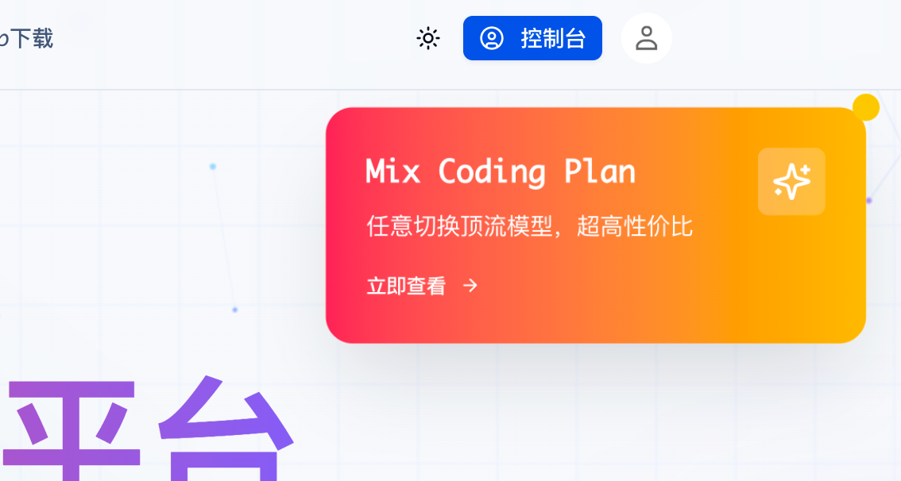

> **注意：** 未注册用户需要先完成手机号验证才能继续操作。

#### 步骤 2：领取免费套餐

注册完成后，可以领取免费套餐体验平台功能：

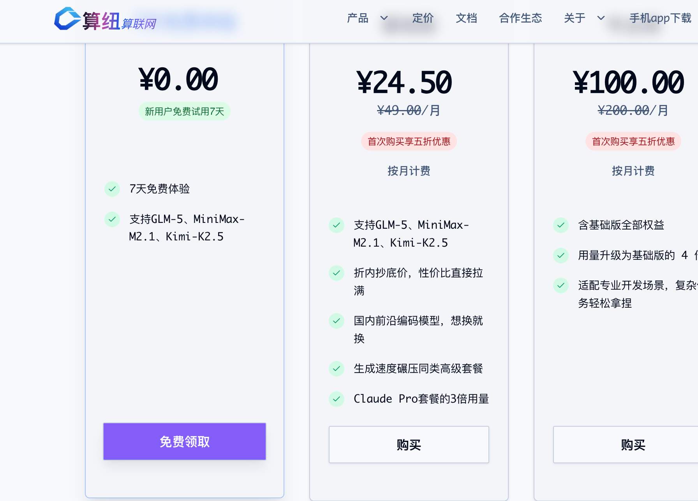

- 点击 **「立即领取」** 按钮完成领取

套餐支持的模型：Kimi-K2.5，MInimax-M2.5，GLM-5

#### 步骤 3：创建用量 API Key

领取套餐后，在 API 管理页面创建用于调用的 Key：

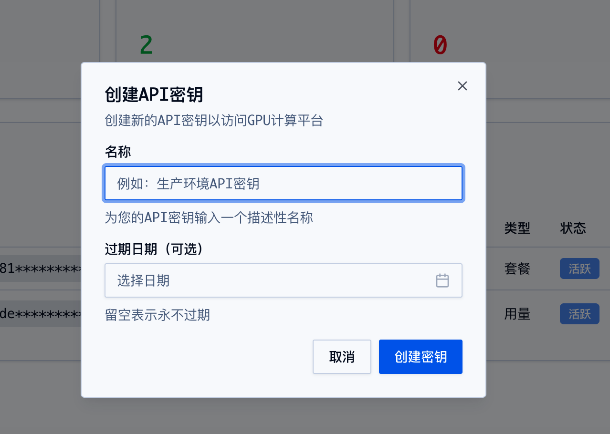

支持的模型可以从[这里](https://gpunexus.com/zh/models)查看。

**创建步骤：**

1. 进入 API 管理页面
2. 点击 **「创建用量 Key」** 按钮
3. 填写 Key 名称（如 `openclaw`）
4. 选择所属模型（可选择「全部」）
5. 点击确认完成创建

**Key 信息说明：**

| 字段     | 示例值           | 说明                |
| -------- | ---------------- | ------------------- |
| Key 名称 | openclaw         | 自定义的标识名称    |
| API Key  | sk-XXXXXXXXXXXXX | 调用 API 使用的密钥 |
| 所属模型 | 全部             | 可用模型范围        |
| 创建时间 | 2026-02-02       | 创建日期            |

> **重要提示：** 创建完成后，请妥善保存 API Key，该 Key 只显示一次，后续将无法查看完整内容。

---

## 4. 配置文件详解

### 4.1 生成默认配置

首次使用，运行 setup 命令生成默认配置文件：

```bash
$ openclaw setup
```

这会在当前目录创建 `.openclaw` 文件夹和 `openclaw.json` 配置文件。

**查看默认配置：**

```bash
$ cat .openclaw/openclaw.json
```

**默认内容：**

```json
{
  "agents": {
    "defaults": {
      "workspace": "/home/neo/.openclaw/workspace"
    }
  },
  "meta": {
    "lastTouchedVersion": "2026.2.1",
    "lastTouchedAt": "2026-02-27T04:01:18.075Z"
  }
}
```

### 4.2 配置模型提供方

编辑配置文件，添加 GPUNexus 模型支持。以下是两个配置示例：

#### 4.2.1 OpenAI 兼容接口配置（以 MiniMax-M2.1 为例）

```json
{
  "models": {
    "providers": {
      "GPUNexus": {
        "baseUrl": "https://api.gpunexus.com/v1",
        "apiKey": "sk-XXXXXXXXXXXXX",
        "auth": "token",
        "api": "openai-completions",
        "headers": {},
        "authHeader": true,
        "models": [
          {
            "id": "MiniMax-M2.1",
            "name": "MiniMax-M2.1",
            "api": "openai-completions",
            "reasoning": false,
            "input": ["text"],
            "cost": {
              "input": 1048576,
              "output": 1048576,
              "cacheRead": 0,
              "cacheWrite": 0
            },
            "contextWindow": 1048576,
            "maxTokens": 1048576,
            "compat": {
              "supportsStore": false,
              "maxTokensField": "max_tokens"
            }
          }
        ]
      }
    }
  }
}
```

#### 4.2.2 Claude Code 接口配置（以 GLM-5 为例）

```json
{
  "models": {
    "providers": {
      "GPUNexus-code": {
        "baseUrl": "https://coding.gpunexus.com",
        "apiKey": "sk-XXXXXXXXXXXXX",
        "api": "anthropic-messages",
        "models": [
          {
            "id": "GPUNexus",
            "name": "GPUNexus"
          }
        ]
      }
    }
  }
}
```

### 4.3 完整配置字段说明

#### 模型提供方字段

| 字段         | 类型    | 必填 | 说明                                                   |
| ------------ | ------- | ---- | ------------------------------------------------------ |
| `baseUrl`    | string  | 是   | API 服务的基地址                                       |
| `apiKey`     | string  | 是   | 您的 API Key                                           |
| `auth`       | string  | 否   | 认证方式，如 `token`                                   |
| `api`        | string  | 是   | API 类型：`openai-completions` 或 `anthropic-messages` |
| `headers`    | object  | 否   | 自定义请求头                                           |
| `authHeader` | boolean | 否   | 是否在请求头中传递认证信息                             |

#### 模型字段

| 字段            | 类型    | 说明                     |
| --------------- | ------- | ------------------------ |
| `id`            | string  | 模型唯一标识             |
| `name`          | string  | 模型显示名称             |
| `api`           | string  | 使用的 API 类型          |
| `reasoning`     | boolean | 是否支持推理模式         |
| `input`         | array   | 支持的输入类型           |
| `cost`          | object  | 价格配置（单位：tokens） |
| `contextWindow` | number  | 上下文窗口大小           |
| `maxTokens`     | number  | 最大输出 token 数        |
| `compat`        | object  | 兼容性配置               |

---

## 5. 启动服务

### 5.1 运行 onboard 命令

完成模型配置后，启动服务：

```bash
$ openclaw onboard
```

### 5.2 向导配置步骤

根据以下截图选择配置选项：

#### 步骤 1：选择配置模式

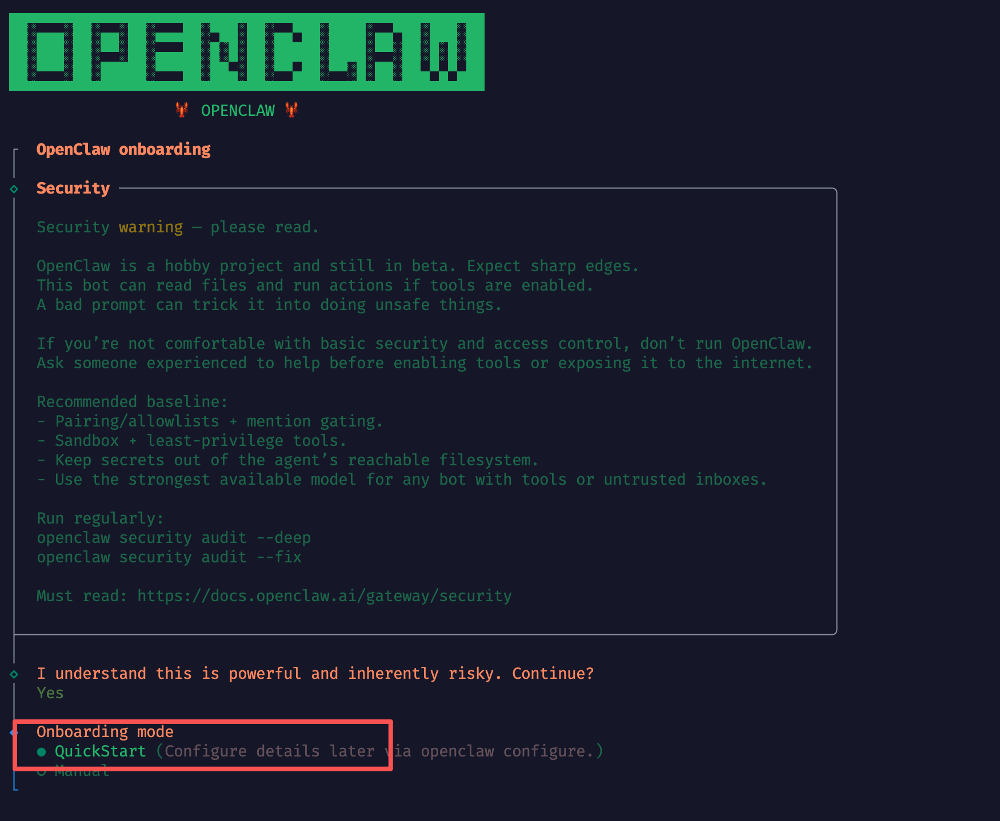

选择 **Use existing configuration**（使用已有配置）

#### 步骤 2：选择配置文件

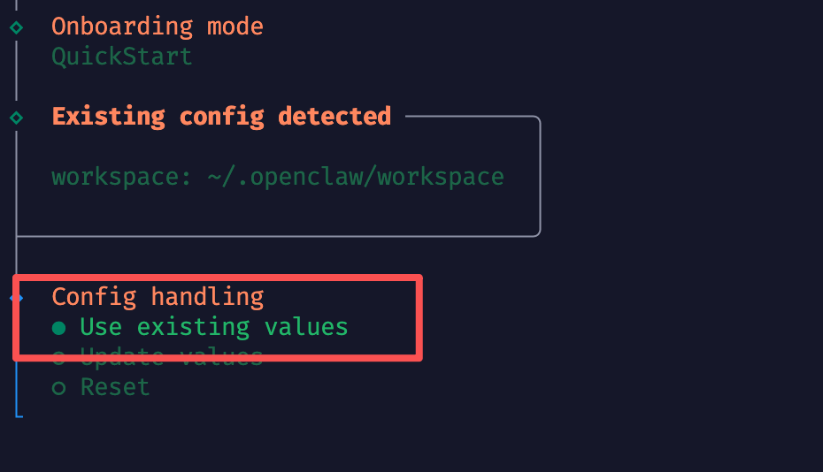

选择 **Use specified config file**（使用指定配置文件）

#### 步骤 3：跳过 Provider 配置

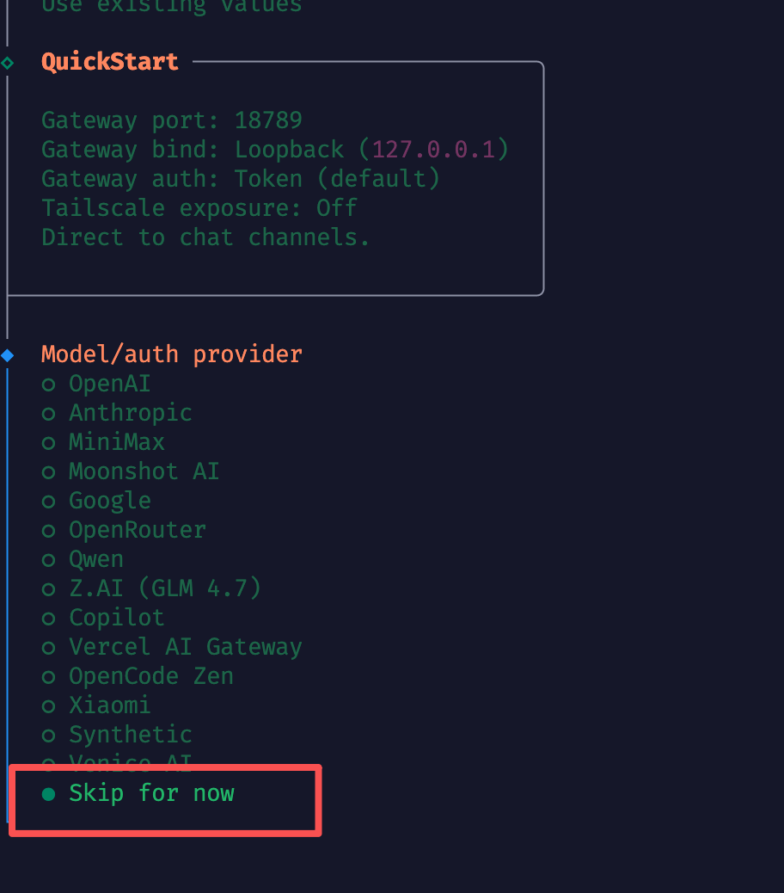

选择 **Skip this step**（跳过此步骤），因为我们已经在配置文件中添加了模型

#### 步骤 4：选择模型提供方

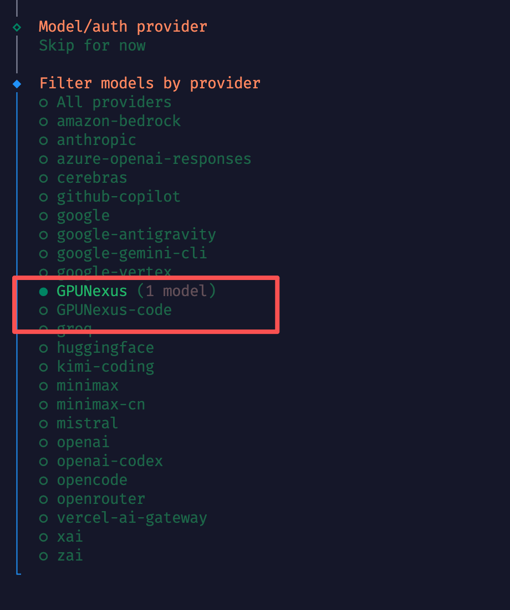

选择我们刚才配置的 **GPUNexus** 作为模型提供方

#### 步骤 5：选择具体模型

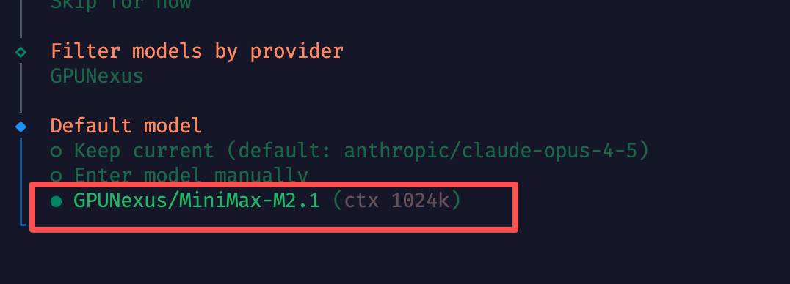

选择 **MiniMax-M2.1** 作为主模型

#### 步骤 6：跳过 Channel 配置

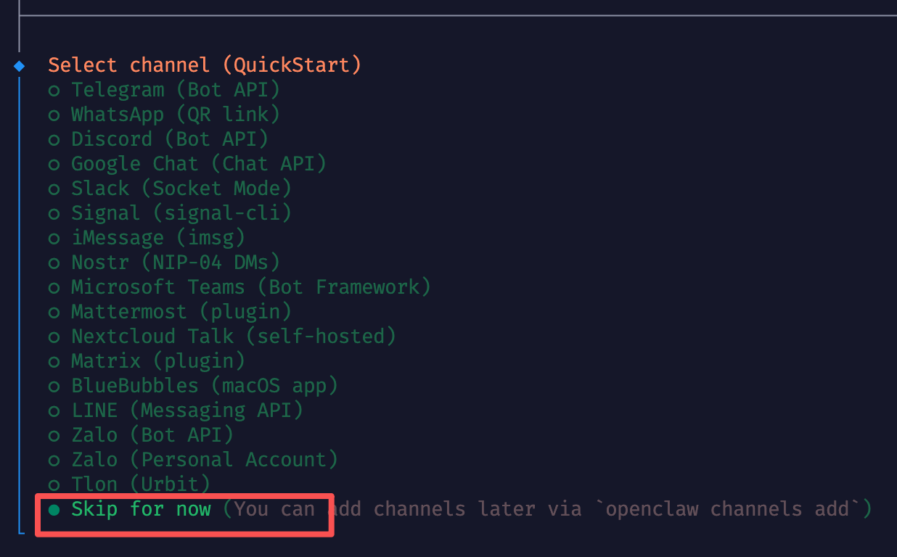

选择 **Skip this step**（跳过此步骤）

#### 步骤 7：跳过 Skills 配置

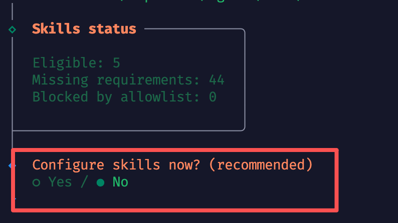

选择 **Skip this step**（跳过此步骤）

#### 步骤 8：跳过 Hook 配置

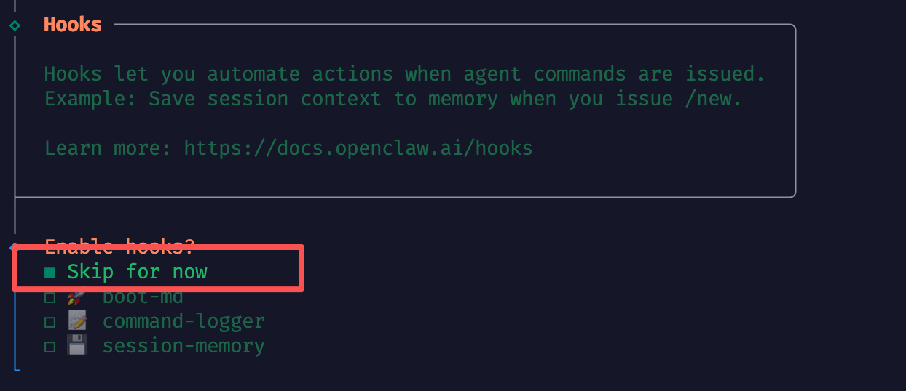

选择 **Skip this step**（跳过此步骤）

#### 步骤 9：重启服务

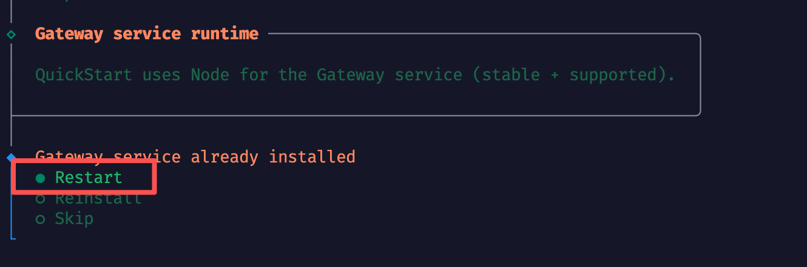

服务配置完成，选择 **Restart** 重启服务

### 5.3 验证服务启动

服务启动成功后，终端会显示类似以下信息：

- 服务端口（默认 18789）
- WebUI 访问地址
- Token 认证信息

---

## 6. 访问 WebUI

### 6.1 本地访问

服务启动后，可在浏览器中访问：

```
http://127.0.0.1:18789/?token=YOUR_TOKEN
```

或使用 localhost：

```
http://localhost:18789/?token=YOUR_TOKEN
```

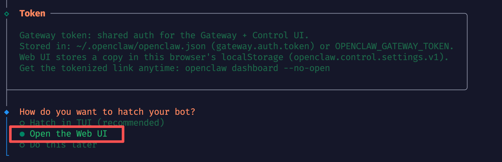

> **注意：** 首次访问需要填写 Token，该 Token 在配置文件的 `gateway.auth.token` 字段中。

### 6.2 远程访问（SSH 隧道）

OpenClaw Gateway 默认绑定到 `127.0.0.1`（本地回环），这是最安全的配置。如果需要从其他机器访问，建议使用 SSH 隧道。

**SSH 隧道优势：**
- 安全（加密传输）
- 稳定
- 无需修改 Gateway 配置

**建立 SSH 隧道：**

```bash
$ ssh -N -L 18790:127.0.0.1:18789 用户名@虚拟机IP
```

**参数说明：**
- `-N`：不执行远程命令，只建立隧道
- `-L`：本地端口转发
- `18790`：本地监听端口
- `127.0.0.1:18789`：远程 OpenClaw 服务地址

**访问 WebUI：**

隧道建立后，在本地浏览器访问：

```
http://localhost:18790/?token=YOUR_TOKEN
```

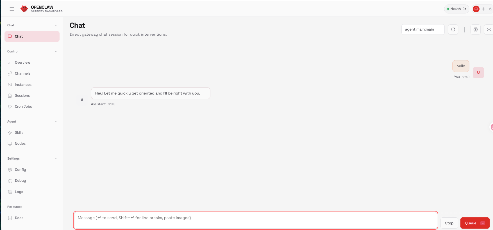

---

## 7. 高级配置

### 7.1 多模型配置

可以在配置文件中添加多个模型：

```json
{
  "models": {
    "providers": {
      "GPUNexus": {
        "baseUrl": "https://api.gpunexus.com/v1",
        "apiKey": "sk-XXXXXXXXXXXXX",
        "api": "openai-completions",
        "models": [
          {
            "id": "MiniMax-M2.1",
            "name": "MiniMax-M2.1"
          },
          {
            "id": "Another-Model",
            "name": "Another Model"
          }
        ]
      }
    }
  }
}
```

### 7.2 Gateway 配置说明

Gateway 是 OpenClaw 的 Web 服务入口，关键配置项：

```json
{
  "gateway": {
    "port": 18789,
    "mode": "local",
    "bind": "loopback",
    "auth": {
      "mode": "token",
      "token": "e37beffddc4db9136dcbc89a2178421d13a8b8e390d68e31"
    }
  }
}
```

| 字段         | 说明                        |
| ------------ | --------------------------- |
| `port`       | 服务端口，默认 18789        |
| `mode`       | 运行模式：`local` 本地模式  |
| `bind`       | 绑定地址：`loopback` 仅本地 |
| `auth.mode`  | 认证模式：`token` 使用令牌  |
| `auth.token` | 认证令牌                    |

---

## 8. 常见问题

### Q1: 配置文件路径在哪里？

默认路径为 `./.openclaw/openclaw.json`（当前目录）或 `~/.openclaw/openclaw.json`（用户主目录）。

### Q2: 如何更新 API Key？

直接编辑配置文件中的 `apiKey` 字段，然后重启服务即可。

### Q3: 服务启动失败怎么办？

1. 检查 Node.js 版本是否满足要求
2. 确认配置文件格式正确（JSON 语法）
3. 检查 API Key 是否有效
4. 查看终端错误日志

### Q4: 如何查看服务状态？

```bash
$ openclaw status
```

### Q5: 如何重新运行配置向导？

```bash
$ openclaw onboard
```

### Q6: Token 忘记了怎么办？

查看配置文件中的 `gateway.auth.token` 字段。

---

## 附录：完整配置文件示例

```json
{
  "meta": {
    "lastTouchedVersion": "2026.2.1",
    "lastTouchedAt": "2026-02-27T04:36:56.929Z"
  },
  "models": {
    "providers": {
      "GPUNexus": {
        "baseUrl": "https://api.gpunexus.com/v1",
        "apiKey": "sk-XXXXXXXXXXXXX",
        "auth": "token",
        "api": "openai-completions",
        "headers": {},
        "authHeader": true,
        "models": [
          {
            "id": "MiniMax-M2.1",
            "name": "MiniMax-M2.1",
            "api": "openai-completions",
            "reasoning": false,
            "input": ["text"],
            "cost": {
              "input": 1048576,
              "output": 1048576,
              "cacheRead": 0,
              "cacheWrite": 0
            },
            "contextWindow": 1048576,
            "maxTokens": 1048576,
            "compat": {
              "supportsStore": false,
              "maxTokensField": "max_tokens"
            }
          }
        ]
      },
      "GPUNexus-code": {
        "baseUrl": "https://coding.gpunexus.com",
        "apiKey": "sk-XXXXXXXXXXXXX",
        "api": "anthropic-messages",
        "models": [
          {
            "id": "GLM-5",
            "name": "GLM-5"
          }
        ]
      }
    }
  },
  "agents": {
    "defaults": {
      "model": {
        "primary": "GPUNexus/MiniMax-M2.1"
      },
      "models": {
        "GPUNexus/MiniMax-M2.1": {}
      },
      "workspace": "/home/neo/.openclaw/workspace",
      "maxConcurrent": 4,
      "subagents": {
        "maxConcurrent": 8
      }
    }
  },
  "messages": {
    "ackReactionScope": "group-mentions"
  },
  "commands": {
    "native": "auto",
    "nativeSkills": "auto"
  },
  "gateway": {
    "port": 18789,
    "mode": "local",
    "bind": "loopback",
    "auth": {
      "mode": "token",
      "token": "e37beffddc4db9136dcbc89a2178421d13a8b8e390d68e31"
    },
    "tailscale": {
      "mode": "off",
      "resetOnExit": false
    }
  },
  "wizard": {
    "lastRunAt": "2026-02-27T04:36:56.918Z",
    "lastRunVersion": "2026.2.1",
    "lastRunCommand": "onboard",
    "lastRunMode": "local"
  }
}
```

---

*文档版本：1.0*
*最后更新：2026-02-27*
