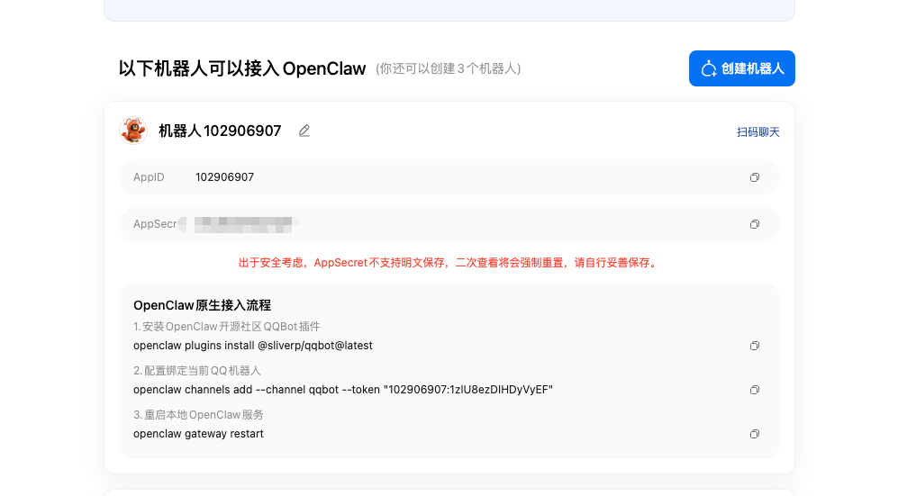
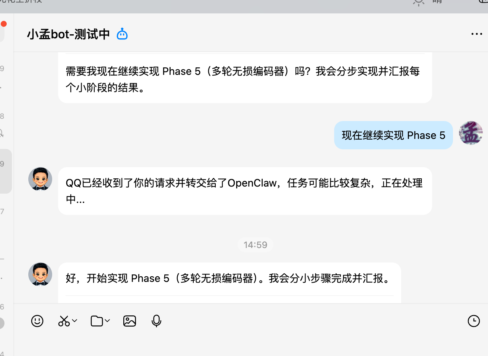

# OpenClaw 接入 QQ 机器人

## 目录

1. [概述](#1-概述)
2. [注册 QQ 机器人](#2-注册-qq-机器人)
   - 2.1 访问注册页面
   - 2.2 扫码登录并创建机器人
   - 2.3 保存凭证信息
3. [安装 QQBot 插件](#3-安装-qqbot-插件)
   - 3.1 安装插件
   - 3.2 验证插件安装
4. [配置 QQ 频道](#4-配置-qq-频道)
   - 4.1 添加 QQ 频道
   - 4.2 配置凭证
   - 4.3 重启服务
5. [验证接入](#5-验证接入)
   - 5.1 检查服务状态
   - 5.2 测试对话功能
6. [高级配置](#6-高级配置)
   - 6.1 多机器人配置
   - 6.2 自定义回复前缀
7. [常见问题](#7-常见问题)

---

## 1. 概述

本文档介绍如何将 QQ 机器人接入 OpenClaw，实现通过 QQ 与 AI 助手对话交互。

**前置要求：**
- 已完成 OpenClaw 基础配置（参考使用手册.md）
- 拥有一个 QQ 账号
- 能够访问 QQ 机器人注册页面

**接入后的功能：**
- 通过 QQ 发送消息与 OpenClaw 对话
- 下发编程任务和指令
- 接收 AI 助手的回复

---

## 2. 注册 QQ 机器人

### 2.1 访问注册页面

使用浏览器访问 QQ 机器人注册页面：

```
https://q.qq.com/qqbot/openclaw/login.html
```



### 2.2 扫码登录并创建机器人

1. 使用 QQ 扫描页面上的二维码进行登录
2. 登录成功后，点击 **「创建机器人」** 按钮
3. 根据提示完成机器人创建

### 2.3 保存凭证信息

创建成功后，页面会显示以下信息：

| 字段 | 说明 | 注意事项 |
| ---- | ---- | -------- |
| **AppID** | 机器人的唯一标识符 | 长期有效 |
| **AppSecret** | 机器人调用 API 的密钥 | **只会显示一次，请立即保存** |

> **重要提示：** AppSecret 只会在创建时显示一次，之后无法查看。如果忘记，需要在机器人管理页面重置。请妥善保存这两项凭证信息。

---

## 3. 安装 QQBot 插件

### 3.1 安装插件

在命令行中执行以下命令安装 OpenClaw 社区的 QQBot 插件：

```bash
$ openclaw plugins install @sliverp/qqbot@latest
```

**安装过程说明：**

- 插件会自动下载并安装
- 安装完成后会显示成功提示

### 3.2 验证插件安装

可以通过以下命令查看已安装的插件列表：

```bash
$ openclaw plugins list
```

确认 `@sliverp/qqbot` 插件已成功安装。

---

## 4. 配置 QQ 频道

### 4.1 添加 QQ 频道

将新建的 QQ 机器人配置为 OpenClaw 的消息频道：

```bash
$ openclaw channels add --channel qqbot --token "${{AppID}}:${{AppSecret}}"
```

**参数说明：**

| 参数 | 说明 | 示例 |
| ---- | ---- | ---- |
| `--channel` | 频道类型，固定为 `qqbot` | `qqbot` |
| `--token` | 机器人凭证，格式为 `AppID:AppSecret` | `123456789:abcdefghijklmnopqrstuvwxyz` |

**命令示例（请替换为您的实际凭证）：**

```bash
$ openclaw channels add --channel qqbot --token "1234567890:ABCDEFGHIJKLMNOPQRSTUVWXYZ1234567890"
```

### 4.2 配置凭证

如果需要在配置文件中直接配置（可选），可以在 `openclaw.json` 中添加：

```json
{
  "channels": {
    "qqbot": {
      "enabled": true,
      "token": "your-appid:your-appsecret"
    }
  }
}
```

> **安全提示：** 建议通过命令行参数配置，避免在配置文件中明文存储凭证。

### 4.3 重启服务

配置完成后，重启 OpenClaw Gateway 服务使配置生效：

```bash
$ openclaw gateway restart
```

**重启成功后会显示：**
- 服务端口信息
- WebUI 访问地址
- Token 认证信息

---

## 5. 验证接入

### 5.1 检查服务状态

确认服务正常运行：

```bash
$ openclaw status
```

确保服务状态为 running/active。

### 5.2 测试对话功能

1. 打开 QQ，使用创建的机器人账号
2. 向机器人发送消息
3. 确认能够收到 OpenClaw 的回复



> **注意：** 首次对话可能需要等待几秒钟进行初始化。

---

## 6. 多机器人配置

如果需要配置多个 QQ 机器人，可以使用不同的频道名称：

```bash
# 机器人 1
$ openclaw channels add --channel qqbot1 --token "${{AppID1}}:${{AppSecret1}}"

# 机器人 2
$ openclaw channels add --channel qqbot2 --token "${{AppID2}}:${{AppSecret2}}"
```

---

## 7. 常见问题

### Q1: 安装插件失败怎么办？

1. 检查网络连接是否正常
2. 确认 npm 源配置正确：
   ```bash
   $ npm config set registry https://registry.npmmirror.com/
   ```
3. 尝试重新安装：
   ```bash
   $ openclaw plugins uninstall @sliverp/qqbot
   $ openclaw plugins install @sliverp/qqbot@latest
   ```

### Q2: 添加频道提示凭证无效？

1. 确认 AppID 和 AppSecret 格式正确
2. 检查 AppSecret 是否正确（注意区分大小写）
3. 如凭证遗忘，请在机器人管理页面重置

### Q3: 重启服务后机器人无响应？

1. 检查服务状态：
   ```bash
   $ openclaw status
   ```
2. 查看日志排查问题：
   ```bash
   $ openclaw logs
   ```
3. 确认机器人账号已登录（部分机器人需要保持在线状态）

### Q4: 如何更新机器人凭证？

```bash
# 先移除旧频道
$ openclaw channels remove qqbot

# 重新添加新凭证
$ openclaw channels add --channel qqbot --token "${{新AppID}}:${{新AppSecret}}"

# 重启服务
$ openclaw gateway restart
```

### Q5: 机器人回复消息很慢怎么办？

1. 检查网络连接质量
2. 确认 GPUNexus API 响应正常
3. 考虑更换模型（参考使用手册.md中的模型配置）

### Q6: 如何完全卸载 QQ 机器人功能？

```bash
# 停止并移除频道
$ openclaw channels remove qqbot

# 卸载插件
$ openclaw plugins uninstall @sliverp/qqbot

# 重启服务
$ openclaw gateway restart
```

---

## 附录：完整配置示例

```json
{
  "meta": {
    "lastTouchedVersion": "2026.2.1",
    "lastTouchedAt": "2026-03-06T00:00:00.000Z"
  },
  "channels": {
    "qqbot": {
      "enabled": true,
      "token": "1234567890:ABCDEFGHIJKLMNOPQRSTUVWXYZ",
      "prefix": ""
    }
  },
  "models": {
    "providers": {
      "GPUNexus": {
        "baseUrl": "https://api.gpunexus.com/v1",
        "apiKey": "sk-XXXXXXXXXXXXX",
        "api": "openai-completions",
        "models": [
          {
            "id": "MiniMax-M2.1",
            "name": "MiniMax-M2.1"
          }
        ]
      }
    }
  },
  "agents": {
    "defaults": {
      "model": {
        "primary": "GPUNexus/MiniMax-M2.1"
      },
      "workspace": "/home/neo/.openclaw/workspace"
    }
  },
  "gateway": {
    "port": 18789,
    "mode": "local",
    "bind": "loopback",
    "auth": {
      "mode": "token",
      "token": "your-token-here"
    }
  }
}
```

---

*文档版本：1.1*
*最后更新：2026-03-06*
